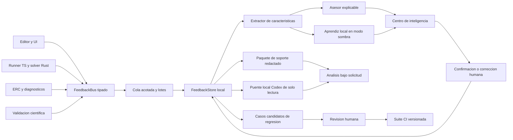

# Plan de retroalimentacion e inteligencia de Astryd Sophia

Fecha de diseno: 2026-07-30.

Implementacion de Fase 0:
[`docs/feedback/README.md`](feedback/README.md).

Implementación de Fase 1:
[`docs/feedback/phase-1-local-backbone.md`](feedback/phase-1-local-backbone.md).

## Decision tecnica

Astryd Sophia no debe comenzar con un LLM incrustado ni con una red neuronal
entrenada sobre sus propias simulaciones. Eso seria costoso, dificil de auditar
y podria aprender como correctos errores del solver.

La estrategia recomendada es:

1. telemetria de dominio local, estructurada y versionada;
2. diagnosticos deterministas explicables;
3. aprendizaje local limitado a recomendaciones y perfiles seguros;
4. validacion cientifica externa como fuente de verdad independiente;
5. exportacion controlada y un puente local de solo lectura para Codex;
6. cualquier agregacion remota como opcion posterior y con consentimiento
   explicito.

El sistema sera propio en sus contratos, reglas, caracteristicas electricas,
politicas de aprendizaje y experiencia de usuario. No conviene reinventar
almacenamiento transaccional, criptografia ni formatos de observabilidad.

## Lo que existe hoy

- El frontend muestra CPU, RAM, FPS y el ultimo error.
- Rust obtiene telemetria del proceso, pero no la persiste.
- `PerformanceMonitor` conserva contadores solo durante la sesion.
- Los resultados de simulacion, ERC y validacion cientifica ya ofrecen buenos
  puntos de instrumentacion.
- No existe una base historica, consentimiento, esquema de eventos, etiquetado
  humano, modelo, registro de recomendaciones ni exportacion de diagnostico.

Por tanto, hoy el simulador observa el estado instantaneo, pero no aprende.

## Limites que deben quedar claros

- Codex no puede observar la aplicacion ni aprender permanentemente por si
  solo. Puede analizar datos cuando el usuario comparte un paquete o conecta
  de forma explicita un puente local autorizado.
- Una mejora de rendimiento no demuestra exactitud fisica.
- Una simulacion no debe usarse como su propia referencia cientifica.
- El aprendizaje nunca debe modificar un circuito, relajar ERC, cambiar un
  modelo fisico o activar firmware sin confirmacion del usuario.
- La telemetria debe estar desactivada para envio externo por defecto.

## Arquitectura objetivo



### Frontera frontend

Nuevos modulos propuestos:

```text
src/feedback/
  contracts.ts
  feedback_bus.ts
  consent.ts
  session_tracker.ts
  simulation_instrumentation.ts
  redaction.ts
  feedback_client.ts
src/ui/
  intelligence_panel.ts
  feedback_dialog.ts
```

El frontend emite eventos tipados; no escribe archivos ni conoce SQLite. El bus
agrupa eventos, limita frecuencia y entrega lotes al backend mediante IPC.

### Frontera Rust

```text
src-tauri/src/feedback/
  mod.rs
  commands.rs
  schema.rs
  store.rs
  migrations.rs
  features.rs
  advisor.rs
  learner.rs
  export.rs
  retention.rs
```

Rust valida de nuevo cada lote, asigna IDs y tiempos confiables, persiste,
calcula agregados y genera exportaciones. La base vive exclusivamente en el
directorio local de datos de la aplicacion.

### Almacenamiento

Usar SQLite mediante una cola de escritura unica y transacciones por lotes.
No abrir una conexion por evento. Si se activa WAL, exigir una version de
SQLite que contenga las correcciones actuales, comprobarla en runtime y
mantener checkpoints y limite de tamano. El diseno debe continuar funcionando
con una sola conexion para reducir concurrencia innecesaria.

Tablas iniciales:

```text
schema_migrations
sessions
events
simulation_runs
solver_steps_aggregate
user_feedback
recommendations
recommendation_outcomes
model_registry
privacy_audit
```

No guardar cada muestra del osciloscopio como una fila. Las trazas grandes se
resumen con estadisticas y, solo si el usuario lo solicita, se adjuntan como un
blob comprimido con cuota separada.

## Contrato de eventos

Todos los eventos usan un sobre comun:

```ts
interface FeedbackEventV1 {
  schemaVersion: 1;
  eventId: string;
  occurredAtUnixMs: number;
  sessionId: string;
  runId?: string;
  appVersion: string;
  gitRevision?: string;
  privacyClass: "operational" | "circuit-derived" | "user-content";
  kind: FeedbackEventKind;
  payload: FeedbackPayload;
}
```

Eventos prioritarios:

- `session.started` y `session.ended`;
- `circuit.summary_created`;
- `erc.completed`;
- `simulation.started`, `completed`, `failed` y `cancelled`;
- `solver.convergence_summary`;
- `solver.step_summary`;
- `performance.sampled`;
- `recommendation.shown`, `accepted`, `rejected` y `outcome`;
- `user.feedback_submitted`;
- `validation.case_completed`;
- `export.created` y `data.deleted`.

La estabilidad del nombre, tipo y version del esquema es parte de la API. Cada
cambio incompatible requiere migracion y pruebas de lectura de versiones
anteriores.

## Datos que si deben recopilarse

### Caracteristicas del circuito

- numero de nodos, ramas y componentes;
- histograma de tipos de dispositivo;
- cantidad de elementos no lineales y reactivos;
- densidad y componentes conexas del grafo;
- presencia de fuentes ideales, lazos y nodos flotantes;
- ordenes de magnitud de R, L, C y constantes de tiempo;
- huella topologica con sal aleatoria local.

No se guardan nombres de archivo, rutas, IDs originales, comentarios, firmware
ni netlist completo en el nivel operativo.

### Resultado numerico

- analisis y configuracion usada;
- convergencia, iteraciones y metodo;
- pasos aceptados y rechazados;
- residuo final, error estimado y motivo de fallo;
- tiempo de CPU, tiempo total y memoria maxima;
- cantidad de puntos producidos;
- activacion de homotopia, reduccion de paso o fallback;
- diferencias contra referencias externas cuando existan.

### Retroalimentacion humana

El usuario puede marcar:

- resultado correcto, dudoso o incorrecto;
- problema de convergencia, rendimiento, interfaz o modelo;
- valor esperado y unidad;
- comentario opcional;
- permiso separado para incluir un circuito redactado.

Una etiqueta humana no se considera verdad cientifica automaticamente. Es una
señal para revision y priorizacion.

## Tres bucles de aprendizaje

### 1. Asesor del simulador

Primera version completamente determinista. Ejemplos:

- explicar por que falla ERC y resaltar la subred responsable;
- detectar rigidez probable y sugerir Gear2;
- detectar un `dt` incompatible con la constante de tiempo minima;
- explicar no convergencia y proponer un perfil conservador;
- advertir que el analisis solicitado sigue siendo experimental;
- comparar el resultado actual con ejecuciones equivalentes previas.

Cada recomendacion incluye:

- evidencia observada;
- regla o modelo que la produjo;
- confianza;
- cambio propuesto;
- riesgo;
- boton para aplicar, rechazar o ver detalles.

### 2. Ajustador local

Solo despues de disponer de datos confiables. Usar un modelo interpretable de
bandit contextual o regresion regularizada sobre un conjunto discreto de
perfiles aprobados:

- integrador;
- multiplicador acotado de `dt`;
- tolerancia dentro de limites seguros;
- maximo de iteraciones;
- estrategia de continuacion.

Recompensa:

```text
convergencia
- penalizacion por tiempo
- penalizacion por memoria
- penalizacion por pasos rechazados
- penalizacion infinita si falla una tolerancia cientifica
```

Debe operar primero en `shadow mode`: calcula que habria recomendado, pero no
cambia nada. Tras superar los criterios de seguridad puede sugerir ajustes; no
debe aplicarlos automaticamente en modo cientifico.

### 3. Aprendizaje del proyecto

Los datos agregados generan:

- ranking de fallos por version y familia de circuito;
- regresiones de rendimiento;
- reglas con baja precision;
- flujos de UI abandonados o repetitivos;
- candidatos reproducibles para pruebas.

Un candidato solo entra al repositorio despues de:

1. redaccion y minimizacion;
2. reproduccion determinista;
3. revision humana;
4. referencia fisica apropiada;
5. prueba que falla antes y pasa despues del cambio.

No se crean commits ni se cambian modelos automaticamente.

## Integracion con Codex

### Opcion inmediata: paquete de soporte

Agregar el comando:

```text
npm run feedback:export
```

El resultado seria `astryd-feedback-<fecha>.zip`:

```text
manifest.json
summary.md
aggregates.json
recent_failures.jsonl
recommendations.jsonl
validation_delta.json
environment.json
redaction_report.json
attachments/                 # solo con consentimiento
```

El usuario puede adjuntarlo a una tarea de Codex. El manifiesto incluye hash,
versiones de esquema, aplicacion y solver, pero no secretos ni rutas locales.

### Opcion integrada: Astryd Feedback Bridge

Crear posteriormente un servidor MCP local de solo lectura, ejecutado por
`stdio`, no por un puerto abierto. Recursos propuestos:

- `astryd://feedback/summary`;
- `astryd://runs/recent`;
- `astryd://failures/{id}`;
- `astryd://versions/compare`;
- `astryd://recommendations/effectiveness`;
- `astryd://validation/status`.

El usuario debe instalar y autorizar explicitamente el puente. Las consultas se
registran en `privacy_audit`. Codex no recibe escritura sobre circuitos,
configuracion ni base de datos. Las propuestas de codigo siguen el flujo normal
de diff, pruebas y aprobacion.

## Privacidad y seguridad

Modos visibles en ajustes:

1. `Desactivado`: no se persiste actividad.
2. `Local`: recomendado; aprende solo en este equipo.
3. `Compartir al exportar`: el usuario revisa cada paquete.
4. `Piloto opt-in`: futuro; envia agregados a infraestructura propia.

Reglas obligatorias:

- consentimiento separado por clase de dato;
- minimizacion y redaccion antes de persistir;
- prohibicion por defecto de firmware, rutas y contenido completo;
- UUID de instalacion rotatorio y no derivado del equipo;
- limite de base configurable, por defecto 250 MB;
- retencion configurable, por defecto 90 dias;
- botones `Ver mis datos`, `Exportar` y `Eliminar todo`;
- borrado verificable de base, adjuntos y backups internos;
- validacion estricta de IPC y limites por lote;
- ningun token o credencial dentro de eventos;
- exportaciones con manifiesto y hashes;
- cifrado del paquete opcional cuando contenga adjuntos.

## Fases de ejecucion

### Fase 0 — Contratos y amenaza

Duracion estimada: 3 a 5 dias.

Entregables:

- ADR de arquitectura;
- catalogo de eventos V1;
- clasificacion de privacidad;
- politica de retencion;
- modelo de amenazas;
- presupuesto de rendimiento;
- wireframes del Centro de inteligencia.

Criterio de salida:

- ninguna pregunta abierta sobre que se recopila, donde vive o quien puede
  leerlo;
- JSON Schema y tipos TS/Rust generados o comprobados desde una fuente comun.

### Fase 1 — Columna vertebral local

Duracion estimada: 1 a 2 semanas.

Entregables:

- `FeedbackBus`;
- lote IPC con backpressure;
- SQLite y migraciones;
- comandos para consultar, exportar y borrar;
- ajustes de consentimiento;
- rotacion y cuotas.

Criterios de salida:

- cero perdida en cierre normal;
- recuperacion comprobada tras terminacion abrupta;
- migraciones hacia delante y rollback documentado;
- sobrecarga menor a 2% en las pruebas de rendimiento;
- 100% de eventos rechazados si exceden esquema o cuotas.

### Fase 2 — Instrumentacion util

Duracion estimada: 1 a 2 semanas.

Estado: implementada y verificada el 3 de agosto de 2026. Evidencia y cobertura
en [`feedback/phase-2-instrumentation.md`](feedback/phase-2-instrumentation.md).

Instrumentar:

- ERC;
- todos los analisis Rust;
- runner interactivo;
- parser SPICE;
- exportadores;
- rendimiento del canvas;
- errores de UI relevantes.

Criterios de salida:

- cada ejecucion tiene un ciclo de vida completo;
- los fallos conservan codigo estable y causa estructurada;
- ninguna traza completa, circuito o firmware aparece sin opt-in;
- pruebas E2E verifican correlacion entre evento, `runId` y pestaña.

### Fase 3 — Centro de inteligencia y feedback humano

Duracion estimada: 1 semana.

Entregables:

- dashboard local;
- historial y filtros;
- formulario de correccion;
- comparacion entre versiones;
- visor de privacidad;
- exportacion redactada.

Criterios de salida:

- el usuario puede entender, corregir, exportar y borrar sus datos;
- accesibilidad por teclado y lector de pantalla;
- paquete reproducible validado por JSON Schema.

### Fase 4 — Asesor determinista

Duracion estimada: 2 semanas.

Entregables:

- motor de reglas versionado;
- primeras 15 a 25 reglas;
- evidencia y explicacion;
- registro de aceptacion y resultado;
- banco de circuitos positivo y negativo.

Criterios de salida:

- precision mayor a 90% en el banco curado;
- cero recomendaciones que violen ERC o limites numericos;
- toda recomendacion puede explicarse y revertirse;
- una regla puede desactivarse sin publicar una aplicacion nueva.

La ultima capacidad solo debe usar paquetes de reglas locales firmados por el
proyecto, no codigo descargado.

### Fase 5 — Aprendizaje en modo sombra

Duracion estimada: 3 a 4 semanas mas periodo de datos.

Entregables:

- extractor de caracteristicas estable;
- registro de datasets y modelos;
- entrenador reproducible;
- bandit o regresor interpretable;
- evaluacion temporal por version;
- rollback de modelo.

Criterios de salida:

- al menos 500 ejecuciones utiles y diversas; este numero es un minimo
  operativo, no garantia estadistica;
- evaluacion sobre sesiones futuras, no sobre los mismos datos de entrenamiento;
- ninguna degradacion en la matriz cientifica;
- recomendacion superior al perfil fijo con intervalo de confianza definido;
- modelo firmado, versionado y desactivable.

### Fase 6 — Puente para Codex

Duracion estimada: 1 semana.

Entregables:

- paquete de soporte;
- resumen Markdown orientado a diagnostico;
- puente MCP local de solo lectura;
- permisos y auditoria de consultas;
- documentacion de uso.

Criterios de salida:

- Codex puede comparar versiones y leer fallos sin acceder a datos excluidos;
- una prueba de caja negra confirma que no existen metodos de escritura;
- desconectar el puente revoca el acceso de inmediato.

### Fase 7 — Piloto y promocion

Duracion minima: 4 a 6 semanas.

Proceso:

- piloto cerrado local-first;
- revision semanal de falsos positivos;
- promocion gradual de reglas;
- aprendizaje siempre en sombra al inicio;
- pruebas prolongadas, multiples equipos y distintas versiones de Windows;
- informe final de utilidad, privacidad y exactitud.

No promover ajustes automaticos hasta disponer de evidencia de campo y
correlacion externa suficiente.

## Matriz de pruebas

### TypeScript

- contratos y exhaustividad de eventos;
- redaccion;
- batching, cuotas y descarte controlado;
- correlacion de pestaña y `runId`;
- panel, consentimiento y accesibilidad;
- ausencia de instrumentacion externa en produccion sin opt-in.

### Rust

- migraciones sobre cada version de esquema;
- transacciones y recuperacion;
- limites de payload;
- consultas y agregados;
- retencion y borrado;
- property tests del extractor;
- reproducibilidad del asesor y modelo;
- rechazo de NaN, infinito y valores fuera de rango.

### Escritorio

- ciclo completo evento → base → panel → exportacion;
- cierre forzado y reapertura;
- base corrupta aislada sin perder circuitos;
- revocacion de consentimiento;
- exportacion sin rutas, firmware ni IDs originales;
- puente Codex de solo lectura;
- rendimiento con millones de pasos resumidos.

### Cientificas

- cada ajuste sugerido se reejecuta contra la matriz versionada;
- separacion estricta entre dataset de ajuste y referencias;
- pruebas de no regresion por metodo de integracion;
- modo cientifico reproduce configuracion y modelo exactos;
- ningun modelo aprendido puede ampliar por si mismo una afirmacion de
  validacion.

## Indicadores

- porcentaje de simulaciones con ciclo de evento completo;
- tasa de fallos por analisis y version;
- p50, p95 y p99 de tiempo, memoria e iteraciones;
- precision y cobertura del asesor;
- aceptacion de recomendaciones y mejora posterior;
- falsos positivos reportados;
- regresiones detectadas antes de release;
- porcentaje de paquetes sin hallazgos de privacidad;
- diferencia contra referencias cientificas;
- crecimiento de base y costo de instrumentacion.

Las metricas de adopcion no deben optimizarse a costa de exactitud o privacidad.

## Orden recomendado

Construir Fases 0 a 4 antes de hablar de “IA” en la interfaz. Esas fases ya
producen un simulador mucho mas inteligente y explicable. La Fase 5 solo tiene
sentido cuando exista suficiente evidencia limpia. La Fase 6 resuelve la
retroalimentacion con Codex sin inventar acceso permanente que la plataforma no
ofrece.

Estimacion realista para una primera version completa local-first: 8 a 12
semanas de una persona experimentada, mas el piloto. Intentar entregar
aprendizaje fiable en pocos dias produciria una demostracion, no un sistema
seguro ni cientificamente defendible.

## Referencias tecnicas

- Tauri 2 limita el acceso del plugin de archivos a directorios especificos de
  la aplicacion:
  <https://v2.tauri.app/plugin/file-system/>
- SQLite documenta concurrencia, checkpoints y limites de crecimiento de WAL:
  <https://www.sqlite.org/wal.html>
- OpenTelemetry documenta por que los nombres y esquemas de telemetria deben
  evolucionar sin romper consumidores:
  <https://opentelemetry.io/docs/specs/otel/versioning-and-stability/>
- Esquemas de telemetria versionados:
  <https://opentelemetry.io/docs/specs/otel/schemas/>
