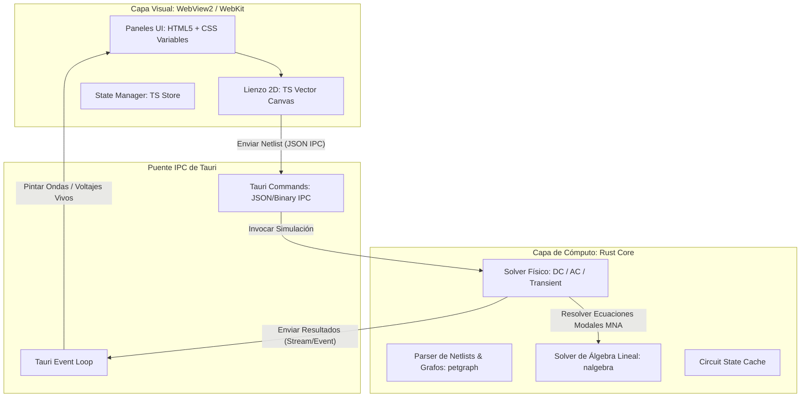

# Proyecto: Astryd Sophia (Tauri + Rust + TypeScript)
## Arquitectura de Alto Rendimiento para Simulación de Circuitos

Este documento es el blueprint técnico definitivo y riguroso para reconstruir el simulador electrónico **Astryd Sophia** utilizando una arquitectura híbrida de máximo rendimiento. Combina la velocidad de cálculo físico de **Rust** con el diseño estético premium de **TypeScript/CSS/Canvas** a través de **Tauri**.

---

## 1. Visión y Objetivos del Proyecto

El objetivo es crear un simulador de circuitos de nivel educativo-profesional que sea visualmente espectacular y computacionalmente eficiente.

### Objetivos Técnicos Críticos
*   **Consumo de RAM:** < 50 MB en reposo (reducción del 80% comparado con Electron).
*   **Velocidad de Simulación:** Multiplicación de rendimiento de **5x a 10x** al trasladar el Solver Newton-Raphson de matrices dispersas a Rust.
*   **Portabilidad:** Distribución de un binario ligero nativo (< 15 MB de peso total del instalador).
*   **Estética:** Interfaz oscura premium con efectos translúcidos (Glassmorphism), transiciones fluidas y micro-animaciones, sin impactar el rendimiento de renderizado.

---

## 2. Arquitectura del Sistema

El simulador se divide en dos capas desacopladas que se comunican mediante un puente IPC asíncrono y seguro:



---

## 3. Especificaciones de Tecnologías

Para garantizar que el sistema funcione al máximo rendimiento y sin cuellos de botella, utilizaremos las siguientes librerías y tecnologías:

### Backend (Rust)
*   **`tauri` (v2.x):** Núcleo del contenedor de escritorio.
*   **`serde` & `serde_json`:** Para la serialización ultra rápida de circuitos entre TypeScript y Rust.
*   **`nalgebra` o `ndarray`:** Para el manejo de matrices densas/dispersas y la resolución de sistemas de ecuaciones lineales simultáneas.
*   **`petgraph`:** Para modelar el esquemático como un grafo matemático (nodos = uniones de cables, aristas = componentes).
*   **`rayon`:** Para paralelizar simulaciones de barrido de parámetros (AC/DC parameter sweep) en múltiples hilos de la CPU.

### Frontend (TypeScript / Vite)
*   **`vite`:** Compilador e inicializador del entorno web frontend.
*   **Vanilla CSS:** Diseño estético premium adaptativo con variables dinámicas, gradientes complejos y animaciones nativas.
*   **HTML5 Canvas (2D Context):** Renderizado del lienzo del circuito a 60 FPS estables con técnicas de culling (dibujar solo lo visible) y snapping (alineación a la rejilla).

---

## 4. Plan de Trabajo Faseado y Riguroso

Este flujo de trabajo está diseñado de manera incremental y obsesiva para que cada paso se construya sobre cimientos 100% verificados.

### FASE 1: Configuración del Entorno y Bootstrapping (Semana 1)
*   **Meta:** Tener un cascarón vacío funcional que compile en Rust y TypeScript bajo Tauri con consumo de RAM inicial verificado (< 40MB).
*   **Hitos de Ejecución:**
    1.  Instalar dependencias del sistema (`rustup`, `build-essential`, `webview2`).
    2.  Inicializar el proyecto ejecutando `npx tauri init` vinculándolo a un frontend de Vite con TypeScript.
    3.  Configurar el archivo `src-tauri/Tauri.toml` con permisos estrictos de IPC y tamaño de ventana por defecto optimizado.
    4.  Implementar un comando "ping-pong" básico en Rust para probar el tiempo de respuesta del puente IPC.
*   **Criterio de Aceptación:** Ejecutar `cargo tauri dev` compila perfectamente y levanta una ventana nativa con la consola de desarrollo disponible.

### FASE 2: Diseño del Core Estético e Interfaz de Usuario UI/UX (Semana 1-2)
*   **Meta:** Crear un entorno visual moderno que wowee al usuario a primera vista y establezca la paleta de colores y componentes interactivos.
*   **Hitos de Ejecución:**
    1.  Crear `variables.css` con la paleta de colores HSL oscura, degradados sutiles de acento y parámetros de desenfoque (*backdrop-filter*).
    2.  Construir la barra de herramientas superior, el panel izquierdo de componentes y el panel derecho de propiedades con layouts de CSS Grid y Flexbox.
    3.  Asegurar que los paneles interactivos tengan micro-animaciones en los estados `:hover` y `:active` usando transiciones CSS puras.
    4.  Implementar el sistema de modales dinámicos (para propiedades de componentes y configuraciones de simulación).
*   **Criterio de Aceptación:** La interfaz debe ser completamente responsiva, soportar colapsado de paneles y verse idéntica en cualquier pantalla, consumiendo cero CPU en reposo.

### FASE 3: Motor del Lienzo Interactivo 2D (Semana 2-3)
*   **Meta:** Desarrollar el lienzo interactivo de dibujo técnico en TypeScript utilizando Canvas 2D, con soporte para arrastrar, soltar, conectar cables y hacer zoom.
*   **Hitos de Ejecución:**
    1.  Crear la clase `CanvasOrchestrator` para manejar el ciclo de dibujo y el renderizado de la cuadrícula de fondo (*grid snapping*).
    2.  Implementar la cámara con soporte de zoom (rueda del mouse) y paneo (clic central o barra espaciadora + arrastre), aplicando transformaciones de matriz 2D.
    3.  Desarrollar el renderizador de componentes a partir de primitivas vectoriales (líneas, arcos, rectángulos) definidos en un diccionario de librería.
    4.  Construir el controlador de conexiones (cables) utilizando un algoritmo de enrutamiento ortogonal simple (A* o Manhattan) para evitar que los cables crucen componentes de forma tosca.
    5.  Implementar el sistema de selección múltiple, arrastre en lote y borrado de componentes/cables.
*   **Criterio de Aceptación:** El lienzo debe mantener **60 FPS constantes** con más de 200 componentes en pantalla mientras se hace zoom o paneo continuo.

### FASE 4: El Motor Físico en Rust: Lógica del Grafo y MNA (Semana 3-4)
*   **Meta:** Desarrollar el Solver matemático de simulación electrónica en Rust capaz de analizar circuitos de corriente continua (DC).
*   **Hitos de Ejecución:**
    1.  Definir en Rust las estructuras de datos para los componentes (`Resistor`, `VoltageSource`, `Capacitor`, `Diode`, etc.) mediante enums y traits de comportamiento.
    2.  Construir el parseador de grafos de circuitos en Rust a partir de los datos del esquemático enviados desde TypeScript.
    3.  Implementar el Análisis Funcional Modificado (MNA - Modified Nodal Analysis) para generar de forma dinámica la matriz estampa $A$ y el vector de cargas $z$.
    4.  Escribir el algoritmo iterativo de **Newton-Raphson** en Rust para resolver circuitos con componentes no lineales (como diodos y transistores).
    5.  Añadir validaciones matemáticas preventivas: detección de nodos flotantes, falta de tierra de referencia (GND) y singularidad de matrices.
*   **Criterio de Aceptación:** El solver de Rust debe resolver un divisor resistivo y un circuito de diodos no lineal, entregando voltajes y corrientes exactas validadas contra resultados estándar de SPICE comercial.

### FASE 5: Simulación Transitoria e Instrumentación (Semana 4-5)
*   **Meta:** Añadir soporte en Rust para simulación transitoria (comportamiento en el tiempo) y construir el osciloscopio gráfico en el frontend.
*   **Hitos de Ejecución:**
    1.  Implementar en Rust integradores numéricos para simular capacitores e inductores paso a paso en el tiempo utilizando el método del **Trapecio** o **Backward Euler**.
    2.  Diseñar el mecanismo de flujo de datos por IPC que envíe los resultados paso a paso desde Rust al frontend para no colapsar la memoria RAM.
    3.  Construir un panel de visualización gráfica de ondas (Osciloscopio) en el frontend usando HTML5 Canvas optimizado para graficar miles de puntos en tiempo real.
    4.  Añadir analizadores avanzados: barrido de corriente directa (DC Sweep) y respuesta en frecuencia (AC Analysis).
*   **Criterio de Aceptación:** Graficar la carga y descarga de un capacitor en un circuito RC en tiempo real a 60 FPS en el osciloscopio, sin congelar la interfaz gráfica de usuario.

### FASE 6: Optimización, Empaquetado y Pruebas Unitarias (Semana 5)
*   **Meta:** Asegurar la estabilidad total del sistema mediante pruebas exhaustivas y generar el instalador de producción optimizado.
*   **Hitos de Ejecución:**
    1.  Escribir pruebas unitarias en Rust para verificar el solver con circuitos de prueba conocidos.
    2.  Escribir pruebas de UI en TypeScript para simular clicks del ratón y colocación de cables en el lienzo.
    3.  Configurar la compilación de producción en Rust habilitando optimizaciones de nivel 3 (`opt-level = 3`) y remoción de símbolos redundantes (*lto = true*).
    4.  Generar el instalador nativo de Windows (`.msi` o `.exe` ligero) usando Tauri CLI.
*   **Criterio de Aceptación:** El instalador final debe pesar **menos de 15 MB**, el programa debe arrancar en menos de 500 ms y pasar todas las pruebas unitarias y de integración al 100%.

---

## 5. Diseño del Protocolo de Comunicación IPC (Ejemplo Técnico)

Para evitar que la app sea lenta, definimos un protocolo estricto y tipado de datos entre Rust y TypeScript.

### Definición en TypeScript (`src/types/ipc.ts`)
```typescript
export interface NodeConnection {
    componentId: string;
    pinIndex: number;
}

export interface WireData {
    id: string;
    nodes: string[]; // Nodos eléctricos que conecta
    points: { x: number; y: number }[]; // Trayectoria visual
}

export interface ComponentData {
    id: string;
    type: "resistor" | "capacitor" | "diode" | "vsource" | "ground";
    value: number;
    pins: string[]; // Conexiones de los pines
    x: number;
    y: number;
    rotation: number;
}

export interface CircuitNetlist {
    components: ComponentData[];
    wires: WireData[];
}

export interface SimulationResult {
    nodeVoltages: Record<string, number>;
    branchCurrents: Record<string, number>;
    convergenceIterations: number;
    errorLog?: string;
}
```

### Definición en Rust (`src-tauri/src/main.rs`)
```rust
use serde::{Deserialize, Serialize};
use std::collections::HashMap;

#[derive(Serialize, Deserialize, Debug)]
#[serde(rename_all = "camelCase")]
pub struct CircuitNetlist {
    components: Vec<ComponentData>,
    wires: Vec<WireData>,
}

#[derive(Serialize, Deserialize, Debug)]
#[serde(rename_all = "camelCase")]
pub struct ComponentData {
    id: String,
    #[serde(rename = "type")]
    comp_type: String,
    value: f64,
    pins: Vec<String>,
}

#[derive(Serialize, Deserialize, Debug)]
#[serde(rename_all = "camelCase")]
pub struct WireData {
    id: String,
    nodes: Vec<String>,
}

#[derive(Serialize, Debug)]
#[serde(rename_all = "camelCase")]
pub struct SimulationResult {
    node_voltages: HashMap<String, f64>,
    branch_currents: HashMap<String, f64>,
    convergence_iterations: usize,
    error_log: Option<String>,
}

#[tauri::command]
async fn run_dc_simulation(netlist: CircuitNetlist) -> Result<SimulationResult, String> {
    // 1. Construir grafo del circuito
    // 2. Armar matriz MNA en Rust
    // 3. Ejecutar algoritmo Newton-Raphson
    // 4. Retornar resultados
    
    println!("Recibido circuito con {} componentes", netlist.components.len());
    
    // Simulación simulada de retorno (ejemplo)
    let mut node_voltages = HashMap::new();
    node_voltages.insert("nodo_1".to_string(), 5.0);
    node_voltages.insert("nodo_2".to_string(), 2.5);
    
    Ok(SimulationResult {
        node_voltages,
        branch_currents: HashMap::new(),
        convergence_iterations: 3,
        error_log: None,
    })
}

fn main() {
    tauri::Builder::default()
        .invoke_handler(tauri::generate_handler![run_dc_simulation])
        .run(tauri::generate_context!())
        .expect("error running tauri application");
}
```

